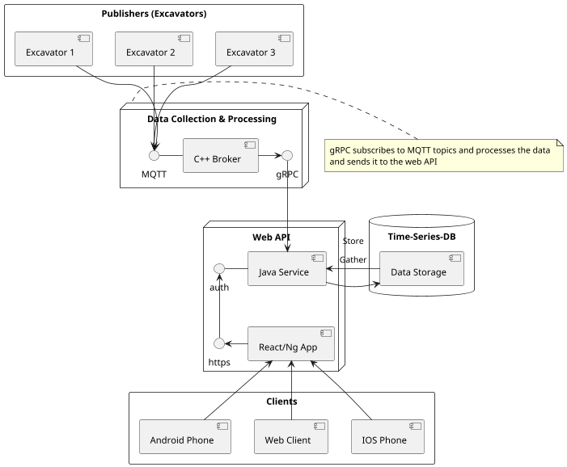
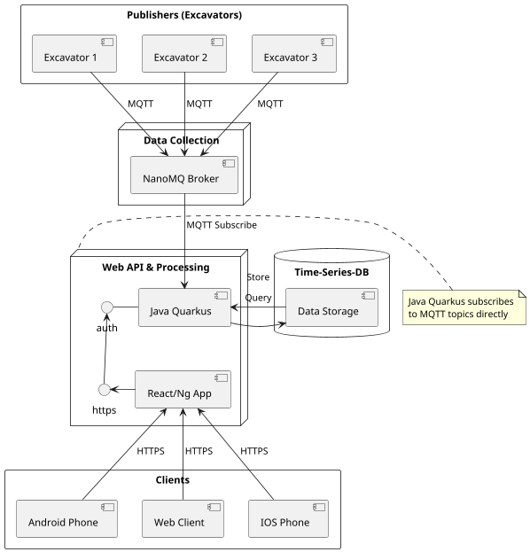

---
# try also 'default' to start simple
theme: seriph
# random image from a curated Unsplash collection by Anthony
# like them? see https://unsplash.com/collections/94734566/slidev
background: https://cover.sli.dev
# some information about your slides (markdown enabled)
title: UE13 SH IOT Bagger
class: text-center
# https://sli.dev/features/drawing
drawings:
  persist: false
# slide transition: https://sli.dev/guide/animations.html#slide-transitions
transition: slide-left
# enable MDC Syntax: https://sli.dev/features/mdc
mdc: true
---

# UE13 SH IOT Bagger

Auf einem weitläufigen Industriegelände sollen Telemetriedaten von Baggern (Daten wie Betriebsstunden, Batteriestatus, Standort und Fehlercodes) drahtlos an einen zentralen Server gesendet werden. Der zentrale Server soll diese Daten speichern und ermöglichen, diese für Überwachungs- und Wartungszwecke auszuwerten.

---

# Technologies

- MQTT 
- HTTPS
- gRPC
- Message Queue
- Wlan / 4G / 5G

---

# MQTT

### Use Case: Data collection (from excavators)
- **Publishers**: The clients (excavators) which will send data to the broker.
- **Broker**: Central MQTT broker receives and forwards messages from all excavators
- **Subscribers**: Servers can subscribe to specific topics (e.g., `excavator/001/battery`)
  
### Reasons
- Lightweight on clients
- Reliable message delivery with QoS (0, 1, 2) levels  (0 = best effort, 1 = at least once, 2 = exactly once)
- Scalable for hundreds of machines
- Minimal bandwidth usage (5G)

---

# gRPC

### Use Case: Data processing
- **Data Processing**: High-speed communication between services
- **Bi-Directional Communication**: Communication between the server and broker (subscription)
  

### Advantages
- Faster parsing
- Parsed values from MQTT Broker get sent to the server via gRPC
- smaller payload size (5G is cheaper)
- Strong typing

---

# HTTPS

### Use Case: Data storage and web access
- **Data Storage**: Storage of telemetry data in databases
- **Web Dashboard**: Maintenance personnel access monitoring dashboards securely
- **API Communication**: REST APIs provide secure access to historical data
- **Mobile Apps**: Maintenance apps communicate via HTTPS
  

### Advantages:
- End-to-end encryption
- Accessible from anywhere
- Authentication methods (OAuth2, JWT, etc.)
- Data persistence

---

# Concrete Example - 4G vs 5G vs WLAN
- **5G**: More expensive, but more flexible and faster
- **4G**: Cheaper than 5G, widely available, but offers lower bandwidth and higher latency
- **WLAN**: Cheapest, but has to be in range of clients

- **Best Suited**: 5G
    - Excavators are mobile, so they could be anywhere

---

# Concrete Examples - MQTT

- **Publisher Sided**
    - **Eclipse Paho**: Available for all C, C++ and Java
    - **mqtt.js**: JavaScript-Based, runs in the browser and in Node.js
    - **Moscapsule**: Not important in this example, however needed for IOS

- **Broker Sided**
    - **NanoMQ**: C-Based, very lightweight
    - **Mosquitto**: Open-Source Java-Based Broker

- **Best Suited**: NanoMQ and Paho
    - Every Device will be able to run C-Based Code
    - Power consumption is minimal
    - NanoMQ, because we use gRPC for data processing, so we need a fast and lightweight broker

---

# Concrete Examples - gRPC

- gRPC is generally available on all languages
- Proto files are used to define the service interface (Not language bound)

- **Best Suited**: gRPC-CPP
    - So it can be used in the same application as NanoMQ
    - Fast and lightweight + Strong typing

---

# Concrete Examples - HTTPS

- **Java Quarkus**: microservices, scalable, Panache ORM, gRPC support
- **C# ASP.NET Core**: cross-platform, enterprise-ready, integrated security, async support
- **Node.js**: event-driven, large ecosystem, JavaScript

- **Best Suited**: Java Quarkus
    - Good for microservices
    - Scalable
    - Panache (ORM)
    - Authentication
    - gRPC

---
src: ./pages/database.md
---

---
src: ./pages/tls-ssl.md
---

---

# Architecture

---

# Alternative Architecture

